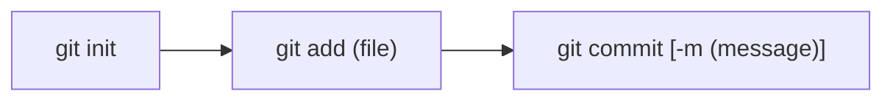

# 今天绝对要把Git搞清楚！-2022-5-24

写在前面：本篇文章是 **100%** 的从 **1** 讲起，也是为了我自己能够理解git所做的记录。（这里的**1**指，至少你得先装好了命令行的git吧😄）

Git的**核心功能**就是进行`版本管理`，也就是仓库里不同时期的各个`状态`，有了git这个工具，我们可以现代化的去进行代码的编写：

即，总是保持主分支是一个可用的分支（也就是常说的**正式版**），而任何新功能的开发，都放在其他分支里（也就是所谓的**测试版**），当测试版的功能确认没有问题后，主分支就可以将其**合并**，以对正式版进行更新迭代。

而如果任何一个分支万一出了问题，没关系，由于git仓库保存了不同时期的各个`状态`，那么就可以进行时光倒流，回到过去的某一个好的`状态`。

这大致就是git的工作流程，下面***就让我们开始吧！***

## 从本地Git开始讲起

### 1. 建立本地git仓库

**所用命令列表：**

* `git init`

在`/Git-test`（本文章案例）目录中开始建立本地git仓库，使用`git init`建立仓库，如下图所示👇

（作为习惯，记得建立仓库后**第一时间**加入`README.md`说明文档)

***

### 2. 在仓库里写代码

#### 所用命令列表：

* `git status`
* `git add <file>`

*ℹ️所用命令列表中的`<text>`并不是真的要把`text`这4个字母敲到命令里，而是表示这里写的应当是能够表达text意义的一个名字，如：`<file>`表示一个文件名，可以是任意文件名，如`test.c` `README.md`等等*

这时候，本地git仓库建立完毕，我们就可以在本地git仓库中开始编写代码，编写结束后可以使用`git status`查看git追踪情况，如下图所示👇

写了一些代码了，下面就可以使用`git add <file>`将未追踪的文件`untracked file`加入到当前`branch`（下面会讲什么是`branch`）的`staging area`暂存区中，以为后续提交`commit`（下面也会讲`commit`）作准备。注意，`git add <file>`命令**不会**真的影响到当前仓库的`branch`，只是先放到暂存区中，让git知道一会`commit`需要提交什么。

*上面这段话提到了许多概念，* ***别害怕*** *，下面就会慢慢讲清楚，这里的重点是理解`git add <file>`命令，它真的只是去* ***告诉*** *git，让git明白，你一会想要把哪些文件的* ***状态*** *去保存下来而已。*

如下图所示👇

---

### 3. 在仓库里进行提交

#### 所用命令如下：

- `git commit [-m <message>]`
- `git log`
- `git checkout [-b] <branch_name> [<commit_id>] `
- `git branch [-d <branch_name>]`

*ℹ️`[]`方括号代表可选的选项*

终于到了**特别重要**的`commit`提交部分了，首先理解到底什么是一个`commit`？其实，`commit`可以理解为仓库保存的一个`状态`，这个`状态`里面存储了所有`tracked file`（git追踪的文件），其`commit`那一刻的样子，也就是说这个`commit`对仓库里的`tracked file`拍了一张照片，同时用一个独一无二的编号把这个照片给保留在了`git log`中，那么这个“照片”作用就有很多了：比如下一次`commit`的时候可以去和之前的`commit`去对比，再比如以后万一某个`commit`把软件整寄了，也可以时空穿梭回来……

所有的commit都有一个独特的编号，可以使用`git log`来查看，如下图所示👇

从图片里可以看到，这里使用了`git commit -m <message>`命令，一共创建了2个commit，后一个含有`git add.png`，前一个没有，那这样就可以通过`git log`来查看👇

这里就看到了2个`commit`，同时可以看到提交时的`<message>`可以查看。

那么如果这时候我想要回到没有`git add.png`的时候（时光倒流），那就可以使用`git checkout <commit_id>`回到那个commit的状态，而为了演示方便，顺便介绍branch的功能，我们可以用`git checkout -b <name> <commit_id>`来开一个新的`branch`分支，让那个分支的状态就是想要回到的那个commit的状态。

这里来理解一下所谓的`branch`到底是什么？其实，`branch`正如其名，是一个分支，就是一个从主干里分出来的一个支干，在创建一个`branch`的时候，会把当前分支的`状态`给拷贝一份成为新分支的初始状态，之后就可以在不同的分支里写代码了（不同分支相互分离），下面也会讲到更具体的案例，**别急喵！**

正好，这里整错了，也记录一下（永远记住，所谓的*经验分享*，有价值的一定是**失败案例**）👇

看看，这里刚才敲了什么命令？`git checkout -b db10d`，这里的`db10d`是一个`<commit_id>`

`<commit_id>`是从`git log`里得到的，`git log`里每个`commit`的那个独一无二的`<commit_id>`虽然很长，但是*基本上*通过前几个十六进制数字就可以定位（git也是这样定位任意一个`commit`的）

但是你新建分支的时候**没起名字**啊，那这个命令里，`db10d`就成了分支的名字，也就是创建了一个名叫`db10d`的分支。所以现在就要把它删了，就应当使用`git branch -d <branch_name>`来删除那个分支。好，下面继续时光倒流👇

😄，成功喵！可以看到我们在`no-pic`这个branch里，是没有`git add.png`这个图片的，说明我们确实回来了，✌️。下面使用命令`git checkout <branch_name>`回到`master`分支，可以看到`git add.png`又出现了👇

---

至此，我们的本地git仓库工作流程大致就讲完了，下面进行技术总结（下图中所有的`()`都代表`<>`，不知道为什么尖括号无法在mermaid流程图中显示）👇

## GitHub远程仓库与本地git仓库的关联（先有本地再有远程）

### 1. 创建远程仓库

#### 所用命令如下：

- `git remote add <远程仓库reference在本地仓库的名字> <远程仓库链接🔗>`

本地git仓库已经很好用了，但我们肯定要在自由的互联网上**OPEN SOURCE！**那就得把我们的仓库关联到在线仓库，好。

先在GitHub上创建一个仓库，如下图所示👇

创建好远程仓库后，可以使用`git remote add <远程仓库reference在本地仓库的名字> <远程仓库的git链接>`来把远程仓库的`reference`加到本地git仓库里，所以到时候我们如果想把`commit` `同步`到远程仓库的时候，就可以用这个`<远程仓库在本地git仓库的名字>`来`git push`。

这里又说了好几个概念，我这就来解释：

- `<远程仓库reference在本地仓库的名字>`，这个就是说，既然远程已经有了一个仓库了，那么我本地想要和远程仓库进行`同步`的话，肯定不会每次都想输那么长的一个远程仓库名字，我们这时候就使用一个所谓`reference`，也就是类似于C中的指针，来指向我们的远程仓库，那就需要给这个`reference`起一个名字，也就是这里的`<远程仓库reference在本地仓库的名字>`
- `<远程仓库的git链接>`，这个就是创建远程仓库之后，我们能够在网页GitHub上看到的链接，在这里就是`git@github.com:BossWangST/git-test1.git`

对了，这里提一下，我还是建议**不要**直接复制GitHub网页里给你的那几个代码去执行，**永远不要去执行自己没搞懂的命令！**网页里的`git branch -M main`实际上会把你当前的分支改名成`main`，但说实话一旦搞了这个，很多人（包括我）都会觉得很乱，因为现在有了3个特殊的名字`master` `main` `origin`一旦搞错了比如执行了`git push origin master`，就又会在远程仓库创建了一个名叫`master`的分支，但是这种时候创建的分支一般是为了创建`pull request`而使用的，如果这时候不了解什么是PR，就会脑子很乱，想*remake*了（惨痛经历）。

---

### 2. 把本地分支`状态`同步至远程仓库

#### 所用命令如下：

- `git push [-u][--set-upstream] <远程reference名字> <想要同步到远程仓库的分支名字>`
- `git checkout [-b] <branch_name>`

下面使用`git push -u origin master`来把`master`分支的状态，`同步`到`origin`这个远程`reference`里，而`-u`这个选项代表以后在`master`分支中的`push`操作都默认同步到`origin`这个远程reference里，也就是说，`git push -u origin master`和`git push --set-upstream origin master`等价。而如果没有`-u`或者`--set-upstream`的话，就得每次`git push <远程reference> <要同步到远程仓库的分支名字>`了。👇

可以看到成功把当前分支master同步到了远程仓库里。注意这里的信息：

- `*[new branch] master -> master`就表示在远程仓库里新创建了一个名字叫`master`的分支，然后这里把``本地的master`分支状态同步到了`远程的master`分支。

- `Branch 'master' set up to track remote branch 'master' from 'origin'.`表示`本地的master`分支已经设定为和`远程reference的origin`中的`远程的master`分支建立了追踪联系，以后在`本地的master`分支中，执行的`git push`就等价于执行了`git push origin master`了。👌

如果我有多个分支，比如master是**正式版**，然后我想加一个新的功能，我开了一个名叫`new-feature`的分支，新建分支是用`git checkout -b <new_branch_name>`，注意，如果直接使用这条命令，那就是相当于创建了一个新的分支，其**状态和创建分支的分支**一样，比如我现在是处于`master`分支里，我使用了`git checkout -b new-feature`，那么这个`new-feature`分支的状态，就是等同于我`master`的状态，但是之后`master`和`new-feature`之间就没关系了。如下图所示👇

---

### 3. 分支的合并`merge`

#### 所用命令如下：

- `git merge <branch_name>`
- `git diff [<branch_name]`
- `git commit -am <message>`

现在假设我在`new-feature`里已经开发好了一个新功能，然后我回到`master`分支准备去把这个新功能`merge`，也就是合并进来，那么我所做的事情就是下面这个笔记里所示👇

好，我们现在来尝试一下👇

这里对`test.c`进行了一些修改，同时因为只修改了一个文件，那么就可以用`git commit -am "<message>"`来直接跳过`git add <file>`的步骤直接`commit`👇

现在又对`test.c`进行了一次修改并提交，就和上面的图里描述的场景一样了，下面我们要测试两种不同情况的`merge`，分别是**有冲突的**和**无冲突的**。

##### 有冲突的

如果是有冲突的merge，是什么情况呢？这里我们再开一个分支`master-copy`把当前master分支的状态复制一份，同时对`master-copy`里的`test.c`来进行一些修改(⚠️**修改了同一行！**这是产生冲突的关键)。

那么此时如果在`master-copy`中想要`git merge new-feature`的话，就会出现冲突，即`master-copy`当前状态里的`test.c`和`new-feature`当前状态里的`test.c`都是从`master`分支里复制过来并进行了一些修改的文件了，如果现在要把`new-feature`分支合并到`master-copy`分支中，你说合并完后`test.c`里的内容听谁的？听`master-copy`的，还是听`new-feature`的？所以我们就需要来处理这个冲突问题：

现在使用`git diff <branch_name>`来在`master-copy`分支中检查和`new-feature`分支的不同👇

可以看两个分支都对原本的`test.c`进行了修改（原本`master`分支里，是只有`printf("Hello world\n");`这一句的）所以下面来尝试进行一下`git merge <branch_name>`👇

😂可以看到git的`Auto-merging`失败了，说有冲突，那么下面就得解决冲突，怎么解决呢？

这时候我们再打开引起冲突的那个文件`test.c`，可以看到git帮我们标注了冲突的位置👇

从`<<<<<<< HEAD`到`=======`是当前分支（这里也看出来，git里HEAD就是当前分支的意思）对`test.c`所做的修改。

而从`=======`到`>>>>>>> new-feature`则是`new-feature`分支对`test.c`所做对修改。

那么我们就需要把冲突解决👇

这里我把标注冲突的符号删除，保留了`master-copy`中的一些修改和`new-feature`中的一些修改，我认为这样是两者共存的一种解决方案，那么此时就认为，冲突解决了，我们再查看`git status`和`git diff`👇

那么在冲突解决之后，我们的`test.c`相当于是融合了`master-copy`分支和`new-feature`分支的修改，就需要在当前分支`master-copy`再进行一次commit(提交)👇

这样我们的有冲突的`merge`就搞定了。

##### 无冲突的

更简单了，连冲突都不用管，直接`git merge <branch_name>`把需要合并的分支合并到当前分支里来就ok了。

---

### 4. 传说中的`pull request`

#### 所用命令如下：

- `git push <远程仓库reference的名字> <想要创建PR的本地分支名字>`
- `git clone <GitHub链接🔗>`
- `git pull`

下面来说所谓的PR，也就是`pull request`到底是个啥。

我们说如果一个仓库有许多人在用，那么很显然只有管理员才可以对主分支进行各种操作（就比如上面的`merge`等），而比方说有一个人是搞A功能的，他自己`git clone`下来了仓库后，开了一个分支叫`func-A`，然后在里面搞开发，一直写一直写，终于有一天，他觉得这个功能OK了，可以合并到主分支里了，但是很显然这个*赛博搬运工*并没有主分支的管理权限，他肯定不能在主分支去做`git merge`这类操作，那怎么办呢？这个时候，就是`pull request`大显身手的地方了。

`pull request`这个名字，

前面是`pull`：我们知道，`git pull`是拉取远程仓库中分支的最新内容同步到本地仓库；

后面是`request`：英文含义是 请求 。

那么很显然，所谓的PR就是先**拉取**`pull`分支同步之后，你又做了一些修改，然后**请求**`request`仓库的管理员来**合并**`merge`你的这个分支。

***这就是PR！***

好，那么我们就来实践一下👇

这里是在`func-A`分支里对`test.c`文件对修改👇

写好了A功能，但现在我们肯定没有`merge`权限，那就只能`git push origin func-A`咯，这里前提是你已经把`远程reference`设置好了👇

可以看到，你现在的这个`git push origin func-A`实际上是在远程仓库里新建了一个名叫`func-A`的分支，同时git也提示你可以用一个链接🔗（在上图中就是`https://github.com/BossWangST/git-test1/pull/new/func-A`）去创建一个`pull request`，我们就试试看👇

打开链接后，就是向仓库提交`pull request`的网页，然后想让管理员去`merge`，所以管理员在GitHub上就能看到这样的信息👇

那么如果管理员认为是ok的，就会去`merge`你的这个分支到主分支去。***你滴任务就完成啦哈哈哈哈！***

同时如果管理员确实`merge`了，你的这个，为了创建PR，而通过`git push origin func-A`在远程仓库创建出来的`func-A`分支，的使命也就到此结束了。

*上面这句话还是比较拗口，可以多读几遍，其实就是刚才我们的`push`操作其目的就是在远程仓库创建一个，可以认为是临时的，分支，这个分支的唯一使命就是去创建PR*。

然后管理员就会给你把分支删了，而你则可以通过`git pull`拉取最新的主分支，就能看到你的修改已经被接受了。***高不高兴？***

👇

只能说很牛了，又犯病了，test.c没commit就push上去了。***你可真是个人才啊伙计。***

不过也好，**失败经历**才是最好的教材！👇

看看现在是什么问题，`test.c`没有`commit`就`push`，会出现2个问题：

- 首先是`test.c`里面的A函数根本没进到主分支里（说明管理员也是*星际玩家*）👇

- 其次就是，你现在想要回到`master`分支去做事的话，git就会提示你说，你要是现在回去了，你刚才辛辛苦苦写的`test.c`就全没了！所以要么进行一次commit提交，要么使用`git stash`来暂存，暂存的事情我们“今天”再聊（现在是2022-5-25 0:03）👇

好，又进行了一次提交，现在又在远程仓库创建了一个，为了创建PR，的分支`func-A`。*去创建PR吧孩子！*

好了，让我们再看看主分支有没有修改吧👇

主分支终于好了，**耶唉！**

好家伙，真是错误频出，回到主分支后，别忘了先`git pull`来拉取最新的远程主分支啊（刚才不是才接受了一个`func-A`的`merge`吗？），如果不`git pull`就`git push`，看看什么鬼样！👇

而在`git pull`之后，就可以看到远程主分支的修改了👇

