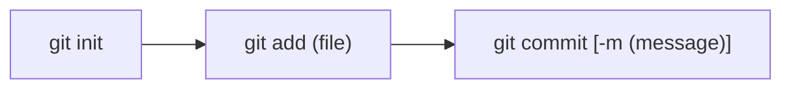

# 今天绝对要把Git搞清楚！-2022-5-24

写在前面：本篇文章是 **100%** 的从 **1** 讲起，也是为了我自己能够理解git所做的记录。（这里的**1**指，至少你得先装好了命令行的git吧😄）

Git的**核心功能**就是进行`版本管理`，也就是仓库里不同时期的各个`状态`，有了git这个工具，我们可以现代化的去进行代码的编写：

即，总是保持主分支是一个可用的分支（也就是常说的**正式版**），而任何新功能的开发，都放在其他分支里（也就是所谓的**测试版**），当测试版的功能确认没有问题后，主分支就可以将其**合并**，以对正式版进行更新迭代。

而如果任何一个分支万一出了问题，没关系，由于git仓库保存了不同时期的各个`状态`，那么就可以进行时光倒流，回到过去的某一个好的`状态`。

这大致就是git的工作流程，下面***就让我们开始吧！***

## 从本地Git开始讲起

### 1. 建立本地git仓库

**所用命令列表：**

* `git init`

在`/Git-test`（本文章案例）目录中开始建立本地git仓库，使用`git init`建立仓库，如下图所示👇

（作为习惯，记得建立仓库后**第一时间**加入`README.md`说明文档)

***

### 2. 在仓库里写代码

#### 所用命令列表：

* `git status`
* `git add <file>`

*ℹ️所用命令列表中的`<text>`并不是真的要把`text`这4个字母敲到命令里，而是表示这里写的应当是能够表达text意义的一个名字，如：`<file>`表示一个文件名，可以是任意文件名，如`test.c` `README.md`等等*

这时候，本地git仓库建立完毕，我们就可以在本地git仓库中开始编写代码，编写结束后可以使用`git status`查看git追踪情况，如下图所示👇

写了一些代码了，下面就可以使用`git add <file>`将未追踪的文件`untracked file`加入到当前`branch`（下面会讲什么是`branch`）的`staging area`暂存区中，为后续提交`commit`（下面也会讲`commit`）作准备。注意，`git add <file>`命令**不会**真的影响到当前仓库的`branch`，只是先放到暂存区中，让git知道一会`commit`需要提交什么。

*上面这段话提到了许多概念，* ***别害怕*** *，下面就会慢慢讲清楚，这里的重点是理解`git add <file>`命令，它真的只是去* ***告诉*** *git，让git明白，你一会想要把哪些文件的 `状态`去保存下来而已。*

如下图所示👇

---

### 3. 在仓库里进行提交

#### 所用命令如下：

- `git commit [-m <message>]`
- `git log`
- `git checkout [-b] <branch_name> [<commit_id>] `
- `git branch [-d <branch_name>]`

*ℹ️`[]`方括号代表可选的选项*

终于到了**特别重要**的`commit`提交部分了，首先理解到底什么是一个`commit`？其实，`commit`可以理解为仓库保存的一个`状态`，这个`状态`里面存储了所有`tracked file`（git追踪的文件），其`commit`那一刻的样子，也就是说这个`commit`对仓库里的`tracked file`拍了一张照片，同时用一个独一无二的编号把这个照片给保留在了`git log`中，那么这个“照片”作用就有很多了：比如下一次`commit`的时候可以去和之前的`commit`去对比，再比如以后万一某个`commit`把软件整寄了，也可以时空穿梭回来……

所有的commit都有一个独特的编号，可以使用`git log`来查看。

我们来尝试进行几次`commit`，如下图所示👇

从图片里可以看到，这里使用了`git commit -m <message>`命令，一共创建了2个`commit`，后一个含有`git add.png`，前一个没有，那这样就可以通过`git log`来查看👇

这里就看到了2个`commit`，同时可以看到提交时的`<message>`信息。

那么如果这时候我想要回到没有`git add.png`的时候（时光倒流），那就可以使用`git checkout <commit_id>`回到那个`commit`的状态，而为了演示方便，顺便介绍branch的功能，我们可以用`git checkout -b <name> <commit_id>`来开一个新的`branch`分支，让那个分支的状态就是想要回到的那个`commit`的状态。

这里来理解一下所谓的`branch`到底是什么？其实，`branch`正如其名，是一个分支，就是一个从主干里分出来的一个支干，在创建一个`branch`的时候，会把当前分支的`状态`给拷贝一份成为新分支的初始状态，之后就可以在不同的分支里写代码了（不同分支相互分离），下面也会讲到更具体的案例，**别急喵！**

正好，这里整错了，也记录一下（永远记住，所谓的*经验分享*，有价值的一定是**失败案例**）👇

看看，这里刚才敲了什么命令？`git checkout -b db10d`，这里的`db10d`是一个`<commit_id>`

`<commit_id>`是从`git log`里得到的，`git log`里每个`commit`的那个独一无二的`<commit_id>`虽然很长，但是*基本上*通过前几个十六进制数字就可以定位（git也是这样定位任意一个`commit`的）

但是你新建分支的时候**没起名字**啊，那这个命令里，`db10d`就成了分支的名字，也就是创建了一个名叫`db10d`的分支。所以现在就要把它删了，就应当使用`git branch -d <branch_name>`来删除那个分支。好，下面继续时光倒流👇

😄，成功喵！可以看到我们在`no-pic`这个`branch`里，是没有`git add.png`这个图片的，说明我们确实回来了，✌️。下面使用命令`git checkout <branch_name>`回到`master`分支，可以看到`git add.png`又出现了👇

---

至此，我们的本地git仓库工作流程大致就讲完了，下面进行技术总结（下图中所有的`()`都代表`<>`，不知道为什么尖括号无法在mermaid流程图中显示）👇

## GitHub远程仓库与本地git仓库的关联（先有本地再有远程）

### 1. 创建远程仓库

#### 所用命令如下：

- `git remote add <远程仓库reference在本地仓库的名字> <远程仓库链接🔗>`

本地git仓库已经很好用了，但我们肯定要在自由的互联网上 **OPEN SOURCE！** 那就得把我们的仓库关联到在线仓库，好。

先在GitHub上创建一个仓库，如下图所示👇

创建好远程仓库后，可以使用`git remote add <远程仓库reference在本地仓库的名字> <远程仓库的git链接>`来把远程仓库的`reference`加到本地git仓库里，所以到时候我们如果想把`commit` `同步`到远程仓库的时候，就可以用这个`<远程仓库在本地git仓库的名字>`来`git push`。

这里又说了好几个概念，我这就来解释：

- `<远程仓库reference在本地仓库的名字>`，这个就是说，既然远程已经有了一个仓库了，那么我本地想要和远程仓库进行`同步`的话，肯定不会每次都想输那么长的一个远程仓库名字，我们这时候就使用一个所谓`reference`，也就是类似于C中的指针，来指向我们的远程仓库，那就需要给这个`reference`起一个名字，也就是这里的`<远程仓库reference在本地仓库的名字>`
- `<远程仓库的git链接>`，这个就是创建远程仓库之后，我们能够在网页GitHub上看到的链接，在这里就是`git@github.com:BossWangST/git-test1.git`

对了，这里提一下，我还是建议**不要**直接复制GitHub网页里给你的那几个代码去执行， **永远不要去执行自己没搞懂的命令！** 网页里的`git branch -M main`实际上会把你当前的分支改名成`main`，但说实话一旦搞了这个，很多人（包括我）都会觉得很乱，因为现在有了3个特殊的名字`master` `main` `origin`一旦搞错了比如执行了`git push origin master`，就又会在远程仓库创建了一个名叫`master`的分支，但是这种时候创建的分支一般是为了创建`pull request`而使用的，如果这时候不了解什么是PR，就会脑子很乱，想*remake*了（惨痛经历）。

---

### 2. 把本地分支`状态`同步至远程仓库

#### 所用命令如下：

- `git push [-u][--set-upstream] <远程reference名字> <想要同步到远程仓库的分支名字>`
- `git checkout [-b] <branch_name>`

下面使用`git push -u origin master`来把`master`分支的状态，`同步`到`origin`这个远程`reference`里，而`-u`这个选项代表以后在`master`分支中的`push`操作都默认同步到`origin`这个远程reference里，也就是说，`git push -u origin master`和`git push --set-upstream origin master`等价。而如果没有`-u`或者`--set-upstream`的话，就得每次`git push <远程reference> <要同步到远程仓库的分支名字>`了。👇

可以看到成功把当前分支master同步到了远程仓库里。注意这里的信息：

- `*[new branch] master -> master`就表示在远程仓库里新创建了一个名字叫`master`的分支，然后这里把``本地的master`分支状态同步到了`远程的master`分支。

- `Branch 'master' set up to track remote branch 'master' from 'origin'.`表示`本地的master`分支已经设定为和`远程reference的origin`中的`远程的master`分支建立了追踪联系，以后在`本地的master`分支中，执行的`git push`就等价于执行了`git push origin master`了。👌

如果我有多个分支，比如`master`是**正式版**，然后我想加一个新的功能，我开了一个名叫`new-feature`的分支，新建分支是用`git checkout -b <new_branch_name>`，注意，如果直接使用这条命令，那就是相当于创建了一个新的分支，其**状态和创建分支的分支**一样，比如我现在是处于`master`分支里，我使用了`git checkout -b new-feature`，那么这个`new-feature`分支的状态，就是等同于我`master`的状态，但是之后`master`和`new-feature`之间就没关系了。如下图所示👇

---

### 3. 分支的合并`merge`

#### 所用命令如下：

- `git merge <branch_name>`
- `git diff [<branch_name]`
- `git commit -am <message>`

现在假设我在`new-feature`里已经开发好了一个新功能，然后我回到`master`分支准备去把这个新功能`merge`，也就是合并进来，那么我所做的事情就是下面这个笔记里所示👇

好，我们现在来尝试一下👇

这里对`test.c`进行了一些修改，同时因为只修改了一个文件，那么就可以用`git commit -am "<message>"`来直接跳过`git add <file>`的步骤直接`commit`👇

现在又对`test.c`进行了一次修改并提交，就和上面的图里描述的场景一样了，下面我们要测试两种不同情况的`merge`，分别是**有冲突的**和**无冲突的**。

##### 有冲突的

如果是有冲突的merge，是什么情况呢？这里我们再开一个分支`master-copy`把当前`master`分支的状态复制一份，同时对`master-copy`里的`test.c`来进行一些修改(⚠️ **修改了同一行！** 这是产生冲突的关键)。

那么此时如果在`master-copy`中想要`git merge new-feature`的话，就会出现冲突，即`master-copy`当前状态里的`test.c`和`new-feature`当前状态里的`test.c`都是从`master`分支里复制过来并进行了一些修改的文件了，如果现在要把`new-feature`分支合并到`master-copy`分支中，你说合并完后`test.c`里的内容听谁的？听`master-copy`的，还是听`new-feature`的？所以我们就需要来处理这个冲突问题：

现在使用`git diff <branch_name>`来在`master-copy`分支中检查和`new-feature`分支的不同👇

可以看两个分支都对原本的`test.c`进行了修改（原本`master`分支里，是只有`printf("Hello world\n");`这一句的）所以下面来尝试进行一下`git merge <branch_name>`👇

😂可以看到git的`Auto-merging`失败了，说有冲突，那么下面就得解决冲突，怎么解决呢？

这时候我们再打开引起冲突的那个文件`test.c`，可以看到git帮我们标注了冲突的位置👇

从`<<<<<<< HEAD`到`=======`是当前分支（这里也看出来，git里HEAD就是当前分支的意思）对`test.c`所做的修改。

而从`=======`到`>>>>>>> new-feature`则是`new-feature`分支对`test.c`所做对修改。

那么我们就需要把冲突解决👇

这里我把标注冲突的符号删除，保留了`master-copy`中的一些修改和`new-feature`中的一些修改，我认为这样是两者共存的一种解决方案，那么此时就认为，冲突解决了，我们再查看`git status`和`git diff`👇

那么在冲突解决之后，我们的`test.c`相当于是融合了`master-copy`分支和`new-feature`分支的修改，就需要在当前分支`master-copy`再进行一次`commit` 👇

这样我们的有冲突的`merge`就搞定了。

##### 无冲突的

更简单了，连冲突都不用管，直接`git merge <branch_name>`把需要合并的分支合并到当前分支里来就ok了。

---

### 4. 传说中的`pull request`

#### 所用命令如下：

- `git push <远程仓库reference的名字> <想要创建PR的本地分支名字>`
- `git clone <GitHub链接🔗>`
- `git pull`

下面来说所谓的PR，也就是`pull request`到底是个啥。

我们说如果一个仓库有许多人在用，那么很显然只有管理员才可以对主分支进行各种操作（就比如上面的`merge`等），而比方说有一个人是搞A功能的，他自己`git clone`下来了仓库后，开了一个分支叫`func-A`，然后在里面搞开发，一直写一直写，终于有一天，他觉得这个功能OK了，可以合并到主分支里了，但是很显然这个*赛博搬运工*并没有主分支的管理权限，他肯定不能在主分支去做`git merge`这类操作，那怎么办呢？这个时候，就是`pull request`大显身手的地方了。

`pull request`这个名字，

前面是`pull`：我们知道，`git pull`是 **拉取** 远程仓库中分支的最新内容同步到本地仓库；

后面是`request`：英文含义是 **请求**  。

那么很显然，所谓的PR就是先**拉取**`pull`分支同步之后，你又做了一些修改，然后**请求**`request`仓库的管理员来**合并**`merge`你的这个分支。

***这就是PR！***

好，那么我们就来实践一下👇

这里是在`func-A`分支里对`test.c`文件对修改👇

写好了A功能，但现在我们肯定没有`merge`权限，那就只能`git push origin func-A`咯，这里前提是你已经把`远程reference`设置好了👇

可以看到，你现在的这个`git push origin func-A`实际上是在远程仓库里新建了一个名叫`func-A`的分支，同时git也提示你可以用一个链接🔗（在上图中就是`https://github.com/BossWangST/git-test1/pull/new/func-A`）去创建一个`pull request`，我们就试试看👇

打开链接后，就是向仓库提交`pull request`的网页，然后想让管理员去`merge`，所以管理员在GitHub上就能看到这样的信息👇

那么如果管理员认为是ok的，就会去`merge`你的这个分支到主分支去。***你滴任务就完成啦哈哈哈哈！***

同时如果管理员确实`merge`了，你的这个，为了创建PR，而通过`git push origin func-A`在远程仓库创建出来的`func-A`分支，的使命也就到此结束了。

*上面这句话还是比较拗口，可以多读几遍，其实就是刚才我们的`push`操作其目的就是在远程仓库创建一个，可以认为是临时的，分支，这个分支的唯一使命就是去创建PR*。

然后管理员就会给你把分支删了，而你则可以通过`git pull`拉取最新的主分支，就能看到你的修改已经被接受了。***高不高兴？***

👇

只能说很牛了，又犯病了，`test.c`没`commit`就`push`上去了。***你可真是个人才啊伙计。***

不过也好，**失败经历**才是最好的教材！👇

看看现在是什么问题，`test.c`没有`commit`就`push`，会出现2个问题：

- 首先是`test.c`里面的A函数根本没进到主分支里（说明管理员也是*星际玩家*）👇

- 其次就是，你现在想要回到`master`分支去做事的话，git就会提示你说，你要是现在回去了，你刚才辛辛苦苦写的`test.c`就全没了！所以要么进行一次`commit`提交，要么使用`git stash`来暂存，暂存的事情我们“今天”再聊（现在是2022-5-25 0:03）👇

好，又进行了一次提交，现在又在远程仓库创建了一个，为了创建PR，的分支`func-A`。*去创建PR吧孩子！*

好了，让我们再看看主分支有没有修改吧👇

主分支终于好了，**耶唉！**

好家伙，真是错误频出，回到主分支后，别忘了先`git pull`来拉取最新的远程主分支啊（刚才不是才接受了一个`func-A`的`merge`吗？），如果不`git pull`就`git push`，看看什么鬼样！👇

而在`git pull`之后，就可以看到远程主分支的修改了👇

至此，我们关于远程仓库的**基本讲解**就结束了，相信这些内容已经可以让你开始动手使用git来做许多事情了。

## 再探时光倒流, PR, 和`branch` -2022-5-25

### 1. 如何撤销`commit`？

#### 所用命令如下：

- `git reset [--hard] <commit_id>`

我们在讲述本地git仓库的一节[在仓库里进行提交](#time-shift)中曾经提到过“时光倒流”这一功能，在这里我们来详细讲解一下。

比方说，我们在一个仓库里已经写了一些代码，然后这时候我们不小心脑子抽了，写了一个明显有问题的程序功能到当前分支里，然后还傻乎乎的`commit`了，这时候当我们发现的时候，该怎么`回到上一个commit`的`状态`中去呢？

这时候我们就需要真正的去“时光倒流”了，如下图所示👇

很明显，我们的*赛博搬运工*不小心把自己对老板的吐槽写到了代码里，然后他可能是忙昏过去了，就这么把这个`test.c`给`commit`了👇

这下他慌了，这要是老板看到了不就寄了吗？但是，**别急喵**，我们可是有git这个神器的，我们下面就使用命令`git reset HEAD~1`来时光倒流👇

OK，我们成功了，使用`git status`进行查看时，发现我们的`test.c`回到了** 修改完但是还没有`commit` **的状态（`FULL DOC.md`也是同理），那么赶紧去把那句话删了吧！

而从上面时光倒流的命令`git reset HEAD~1`中，我们也可以看到`HEAD`就是代指**当前`<commit_id>`**的一个单词，而`HEAD~1`则是代指**上一次的`<commit_id>`**，所以这样就可以回到上一次`commit`时的`状态`了。但是如果想要回到过去**任意一个`commit`时的`状态`**，我们就需要使用命令`git log`来查看之前每次`commit`的`<commit_id>`，然后用这个独一无二的`<commit_id>`去进行`git reset`来达到任意的时光倒流了。注意，这里的*返回状态*是说`commit`里回到了之前的`状态`（也就是当时拍的照片），而文件本身**没有发生改变**。

那如果想要**完全**返回某一个`commit`，那就需要使用命令`git reset --hard <commit_id>`，即我当前`commit`里的修改**全都不要了**，也就是要把当前仓库的`状态`**完全改变**为之前某一个`commit`时候的状态。更具体的说，相比于没有`--hard`选项的`git reset`命令，带有`--hard`选项的重置就是把整个仓库**变成`<commit_id>`对应的`commit`时的状态**，你当前`branch`无论是什么样的，都会全部回到过去的状态了。⚠️ **此命令是较为“危险”的一个命令，请再三确认后再使用** ⚠️

下面为了演示，我们开一个新的分支，防止出现意外把所有东西都整寄了（不过这也不怕，毕竟我们可以时光倒流啊）。👇

我们在新的分支`time-shift`中，把`test.c`里大部分语句都删了（也许只是让*赛博搬运工*稍微发泄了一下罢了），然后我们进行一次`commit`，同时这之后又在里面写了好几次骂老板的话，还都`commit`了，如下图所示👇

**别急！！！！！！！！！！！**差点心脏病要犯了，记录一下问题：我新开`time-shift`分支的时候，忘记在主分支`master`里`commit`对`FULL DOC.md`的修改了，但是`git checkout -b time-shift`命令又成功执行了，正好也说明了：如果在某一个分支中做了一些修改但还没有`commit`，然后这个时候又开了一个新的分支，那么造成的结果就是，**新的分支是对开辟新分支的分支**的`状态`进行了保存，也就是新分支的`状态`就是对**开辟分支状态**的复制，而这里的**开辟分支状态**并不是开辟分支的最新的`commit`记录的`状态`，而是真正的*最新状态*。

我们实际来看一下👇

这是在`time-shift`分支中查看`FULL DOC.md`，可以看到最后的几段文字确实是现在所写的关于时光倒流的内容，但是我刚才在`time-shift`中改到一半突然发现忘记先在`master`分支中提交一下`FULL DOC.md`再开新分支演示了，就赶紧`git checkout master`回到`master`分支，然后打开`FULL DOC.md`，直接人傻了👇

刚才写的关于时光倒流的内容全没了，说明当时确实没有`commit`就直接开了一个新的分支来写东西了，那么这时候就需要用到上面所讲的`merge`的功能了，得在`master`分支中，把`time-shift`的内容合并，如下图所示👇

好了，现在我回到了`master`分支，把`time-shift`分支的内容`merge`了回来，下面记得`commit`之后再到`time-shift`分支去玩一玩`git reset --hard <commit_id>`吧。👇

可以看到，在`time-shift`分支中，我们进行了多次的`commit`，这个时候查看`test.c`的样子，是在第三次`commit`之后，而我想回到过去没有进行任何`commit`的时候，就得通过`git log`来查看到底要回到哪个`commit`的`状态`了👇

可以看到，我们想回到的，应当是最后标有`master`的那个分支，因为那就是我们新建这个`time-shift`分支时候的`状态`，所以我们记住那个`commit`的前几位`<commit_id>`，在这里就是`b42ed`，然后使用`git reset --hard <commit_id>`来进行真真切切的时光倒流，如下图所示👇

😄，这下真的时光倒流了哦，我们整个分支的`状态`都回到了最一开始的时候，是真的完成了时光倒流。

---

### 2. 真实的`pull request`

#### 所用的命令如下：

- `git clone <git链接🔗地址>`

为什么说这一节叫”真实的`pull request`“呢？就是因为，在真实世界里，太多的仓库我们并没有在里面工作的权限，也就意味着我们不可能在本地直接像自己所建立的远程仓库那样，进行`commit`和`push`操作了，那应该怎么办？**别急喵**，GitHub为我们准备了一个名叫`fork`的功能，如下图所示👇

这个`fork`的功能，说白了，就是把别人的仓库直接**拷贝**一份变成你自己的一个仓库，而变成你自己的仓库之后，你就可以直接`git clone <git链接🔗地址>`来把自己的这个远程仓库拉取下来做修改了，而这之后所有操作就都是上面所讲过了，除了`pull request`。

所以这章的名字叫*再探`pull request`*，就是说你自己当然可以在自己的仓库里随意进行各种`merge`，但是这些`merge`并不会真的影响到你`fork`的那个仓库。所以如果你对某个仓库的代码做了一些改进，又想让那个仓库的管理员来`merge`你的分支，就需要把你的想要`commit`的分支，去向原仓库提交一份`pull request`了。如下图所示👇

这里我`fork`了一个仓库，同时下面对其进行些许更改👇

那么如果我想要向**原仓库**提交一份更改，我就可以在网页中的`Pull requests`页面里，去进行提交，如下图所示👇

👌，那么关于通过`fork`来进行向原仓库提出`pull request`的过程就到此为止了。

---

### 3. 又议`branch`

**别急喵**，To be written.

---

## 更加提升git功力的操作 -2022-5-26

### 1. 好的`commit`

#### 所用命令如下：

- `git commit`

我们在[在仓库里进行提交](#time-shift)里就讲到过，git**最最核心**的就是`commit`这个功能了，那么我们之前谈论`commit`时，说每个`commit`相当于对仓库的当前分支拍了一张照片，把`状态`记录了下来，但是那其实是不准确的。

准确的说，我们的每一次`commit`，都做了两件事情：

- 把**暂存区**中的**被修改了的文件**的`状态`记录了下来
- 把这一次之前的`commit`中，**有关这次修改了的文件**的`状态`更新为刚才记录的最新`状态`

那么这样一来，我们的`commit`就可以做得更加**细粒化**，画图来表示的话就是这样👇

下面我们就对`test.c`来做多个地方的修改，来验证这一功能👇

可以看到使用`git add <file> -p`的时候，*git明明没有给我们分开啊？？*，没错，在这里就要介绍git对于`patch`的划分依据了，如果想要修改的文件里，git能把多个修改划分到不同的`hunk`中去（这里的`hunk`和`patch`是等价的概念），那么必须满足一个要求，也就是

[**Unchanged lines are required between changed lines for git to be able to automatically split the patch.**](https://stackoverflow.com/questions/6276752/can-i-split-an-already-split-hunk-with-git)

即，**保持没有改变的行**必须能把**已经改变了的行**给分离开来。那么这时候怎么办呢？**别急喵**，我们观察这时候git给我们的提示，`[y,n,q,a,d,s,e,?]`，这也太多了，那我们就用到哪个讲哪个吧。我们现在要使用的就是`e`，也就是`edit`的简写，我们现在输入`e`回车👇

我们就会进入一个编辑器的界面，git贴心的给我们讲解了这个页面应该怎么操作来把我们的`commit`细粒化到逐行。

首先可以看到，我们文件的修改情况以`+` `-`号表示在了编辑器的第一列，我们的操作如下：

- 对于`-`开头的行，其表示我们在这次修改中，把这一行给删除了，如果我们想要**保留<删除>这个修改**到我们的`commit`中，那么我们就不做任何修改（这个也很直观，既然是保留删除，那肯定`-`是要保留的）；反之，如果我们想要**不把<删除>这个修改**放在我们的`commit`中，我们就**把这里的`-`号改成一个` `空格**（同样很直观，把`-`号改成空格之后，就和没有被修改的内容一样了，会被认为是没有任何修改，也就相当于在`commit`中不会出现**删除**这个修改了）
- 对于`+`开头的行，其表示我们在这次修改中，新增了这一行，那么如果我们想要**保留<新增>这个修改**到我们的`commit`中，那么我们也是不做修改的；反之，如果我们想要**不把<新增>这个修改**放在我们的`commit`中，我们就**把这一行直接删除**（还是很直观，删除了这一行就好像没有新增这一行一样，`commit`中也就不会出现**新增**这个修改了）
- 还有一个，对于`#`开头的行，它就是注释，不会影响到你的真实文件和`commit`中的任何内容

所以，根据我们刚才的分类，更具体的说，应当根据对文件修改的不同**Topic**，应当是一个不同的`commit`，马上我们就会说到一个**好的`commit`**，除了要注意Topic问题，还要关注`commit`的`<message>`的书写，先来看做了什么修改👇

可以看到，我在这里认为，我的Topic分为两个，就是*删除*和*新增*，那么我就把*删除*的修改保留了下来，同时把*新增*的修改给删除了，那么下面就要开始进行`commit`，之前我们的`commit`都是只用一句话描述了我们的`commit`，但是这样对于之后自己的阅览`commit`的时候非常不友好，并不能看出来具体改了哪些内容，所以我们在`commit`的时候，需要将`commit`的`<message>`分为两部分：

- **Subject**=concise summary of what happened；用简短的语言描述精确的修改
- **body**=more detailed explanation
  - What is now **different** than before?
  - What is the **reason** for the change?
  - Is there anything to watch out for / anything particularly remarkable?

也就是说，为了之后阅读的方便，我们应当尽量把每个`commit`的内容都以*Subject+Body*的形式写下，这能为我们提供相当的便利。在此之前，我们可以先使用`git status`查看我们是不是成功将`test.c`分成了多个`hunk`添加到暂存区了👇 

可以看到，我们成功的将`test.c`的一部分加入了将要提交`commit`的暂存区中，这是从`git status`里`test.c`既出现在`not staged to commit`，又出现`changes to commit`两个地方能够得到的结论。下面我们就开始写一个漂亮的`git commit`的`<message>`了👇

可以看到我们的**Subject**是`Updated test.c`，而具体是做了什么更新呢，在**Body**里就写到`Remove func A from test.c`，说明我们的更新是删除了`func-A`，这样的一个`commit`就非常的**好**，就是因为到时候我们查看`git log`的时候，就能够很好的看到每一个`commit`具体的提交内容了👇

在`git log`里我们能够清晰地看到，两次`commit`分别对应了不同的对`test.c`的更新，非常直观。